# Lab Resolution

- [Lab Resolution](#lab-resolution)
- [Setup Nano Server Image for VM IIS02 via Nano Server Image Builder](#setup-nano-server-image-for-vm-iis02-via-nano-server-image-builder)
- [Setup Nano Server Image for VM DNS02 via Powershell](#setup-nano-server-image-for-vm-dns02-via-powershell)

# Setup Nano Server Image for VM IIS02 via Nano Server Image Builder

- **Start [Nano Server Image Builder](https://docs.microsoft.com/en-us/windows-server/get-started/deploy-nano-server), and then select the option `Create a new Nano Server image`**
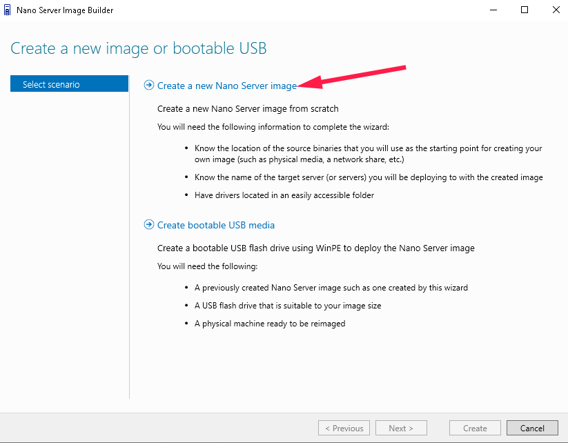
  

- **Select the media mount path of Windows Server 2016 ISO file**
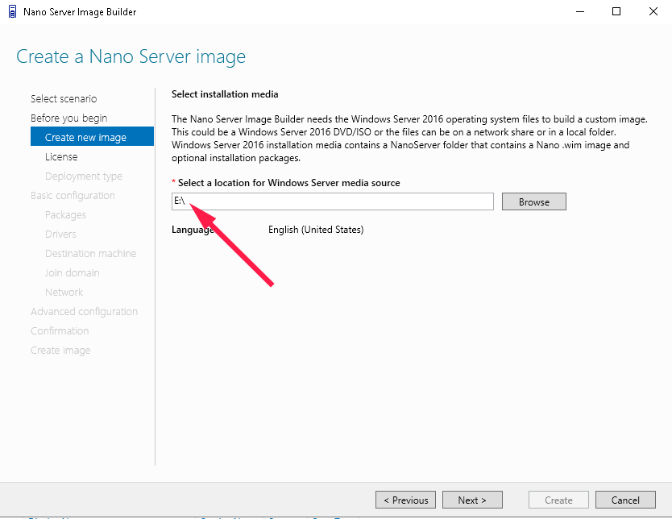
  

- **Accept the contract**
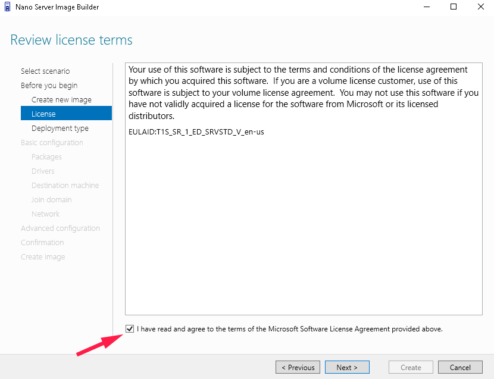
  

- **Set the `output file`**
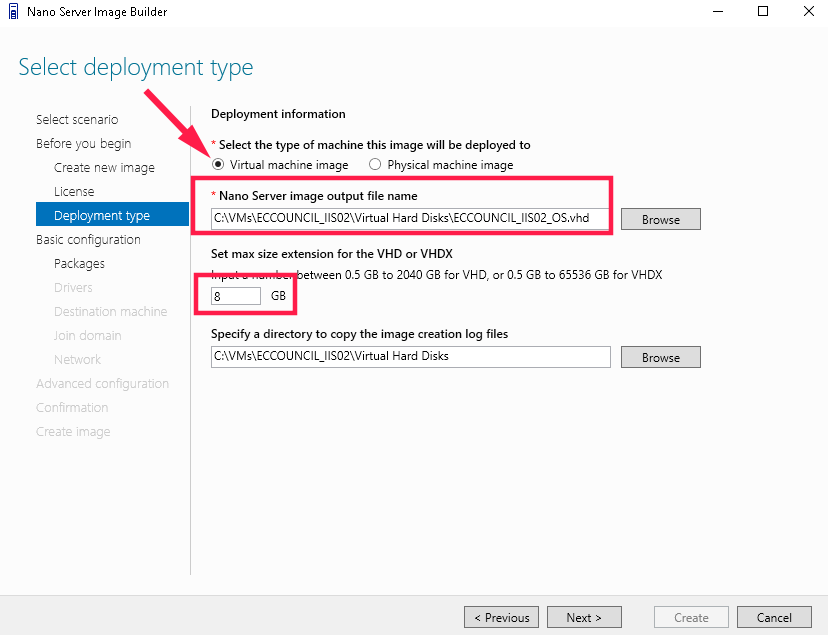

- **Select the role**
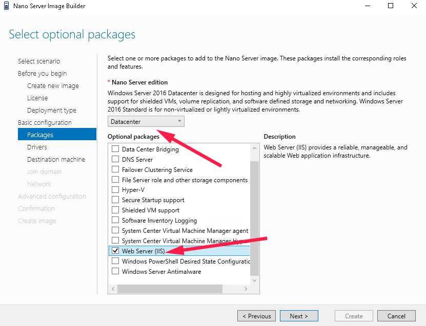
  

- **Set `hostname` and `password`**
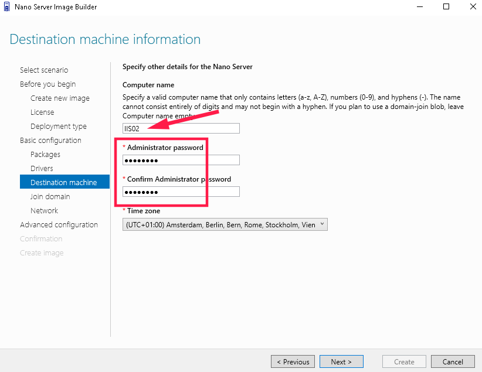
  

- **Select the option `Create basic Nano Server image`**
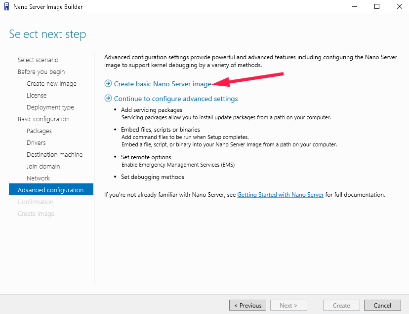
  

- **Review Setings and then click on `Create`**
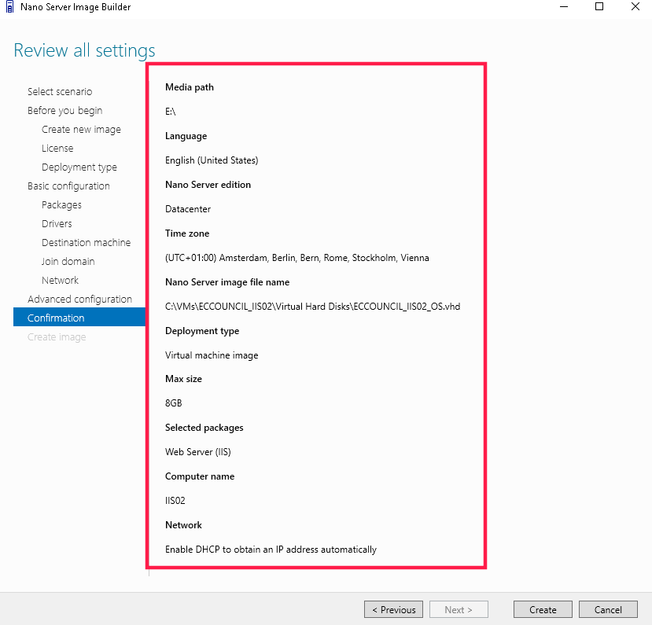
  

- **Wait until process is completed**
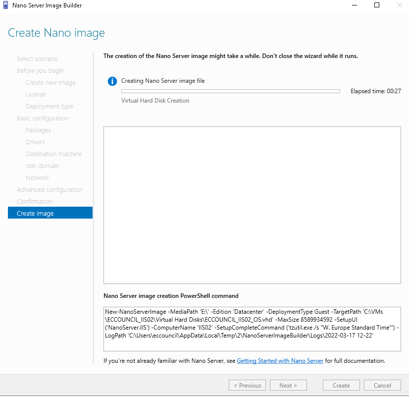
  

- **Edit the settings of `IIS02` VM**
 
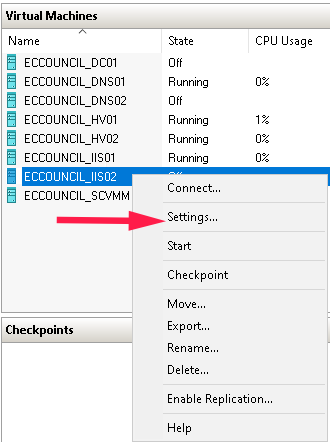
  

- **Add VHD file**
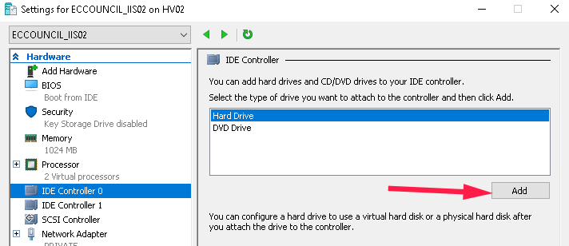
  

- **Set VHD file location**
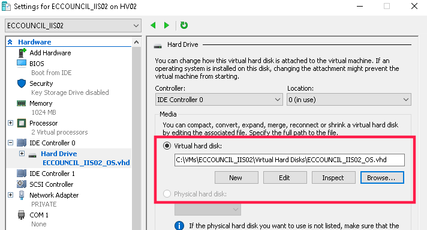
  
  

# Setup Nano Server Image for VM DNS02 via Powershell

It is necessary to run the steps described on script [deploy_dns02.ps1](deploy_dns02.ps1)

During the execution of the script, it is expected via Powershell to run the actions:
- Generate the Blob domain file to join Nano Server on domain
- Import the module NanoServerImageGenerator
- Deploy Nano Server image via Powershell
- Attach VHD to VM
- Start the VM

***After the execution of those steps, it is expect that DNS02 VM will be ready.***
