# Create VM via UI

## Connect to Hyper-V Nano Server node
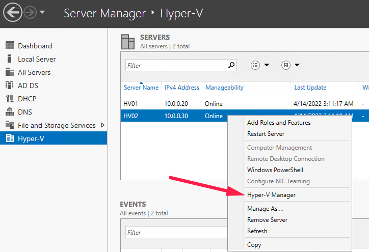

## Create Virtual Switch
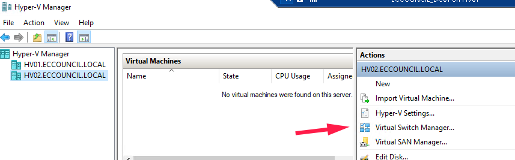

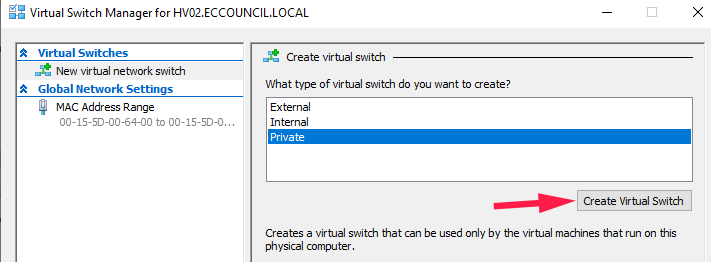

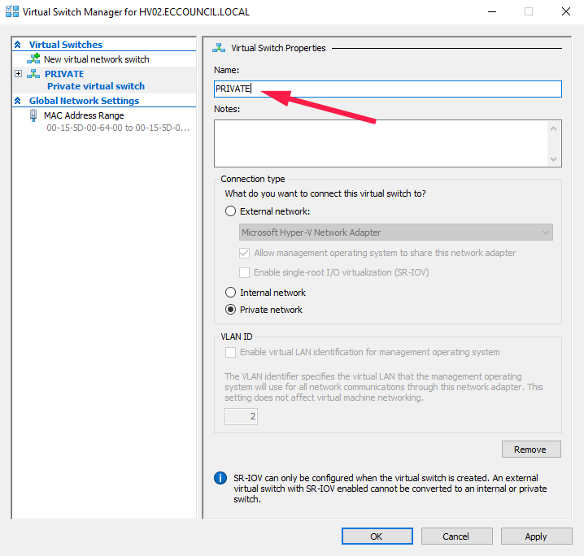

## Create VM
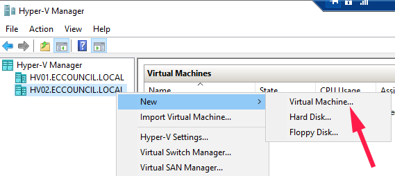

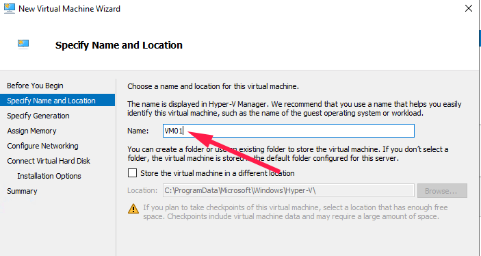

### Set Generation
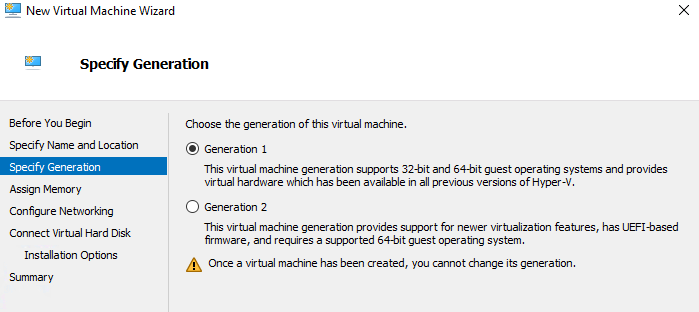

### Set Memory
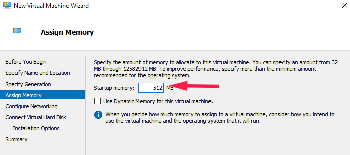

### Connect to vSwitch
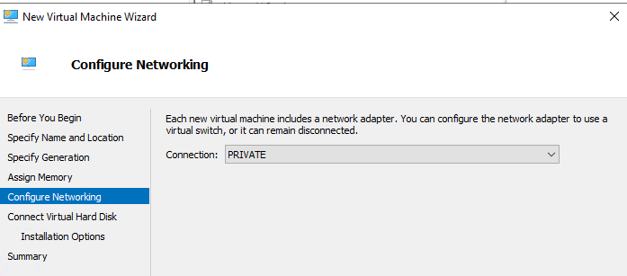

### Create VHD
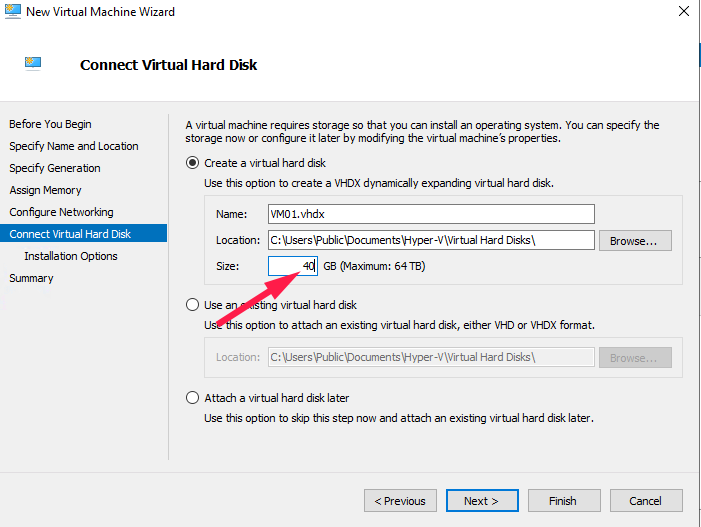

### Set install options
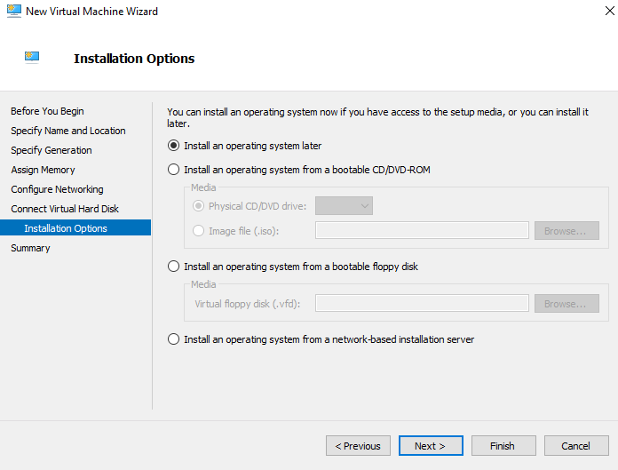

### Check the summary
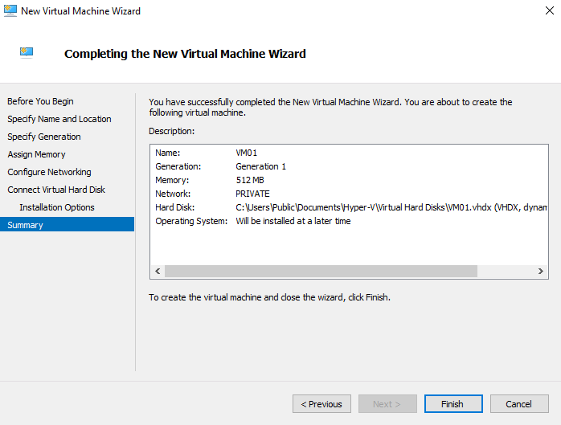