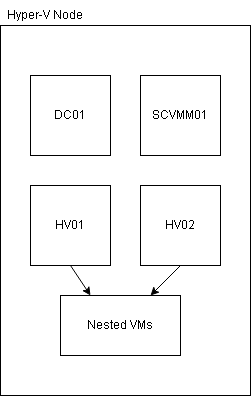
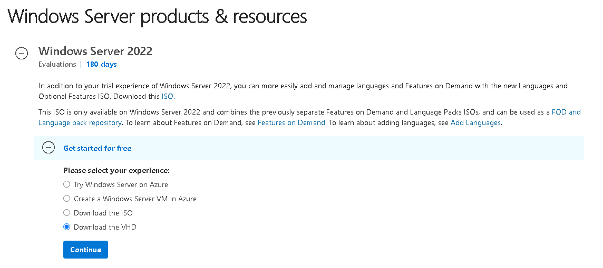
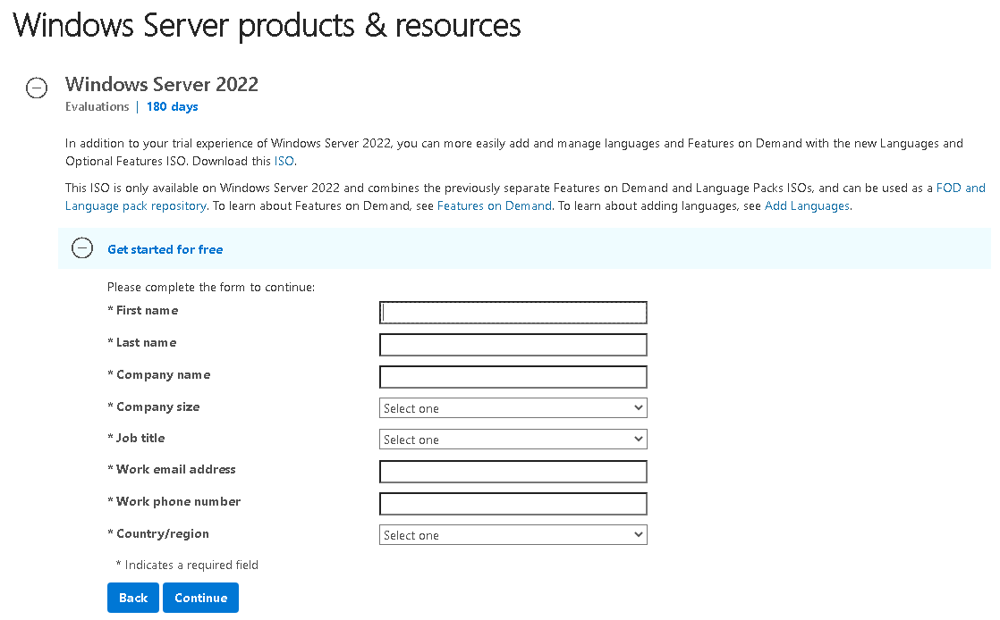
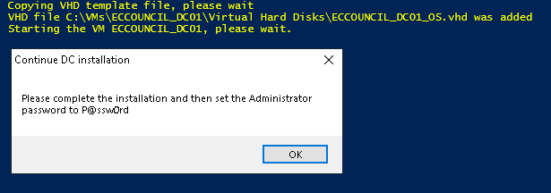
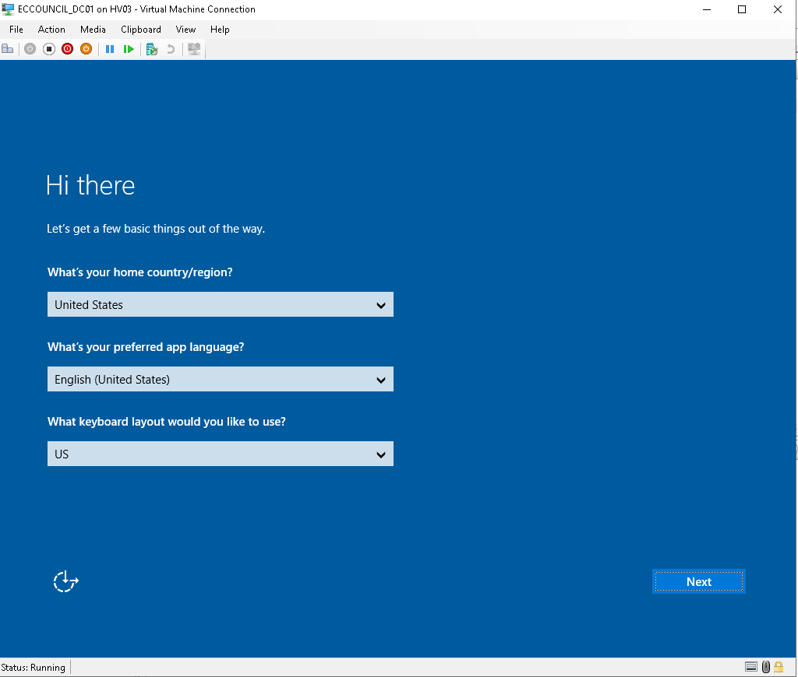
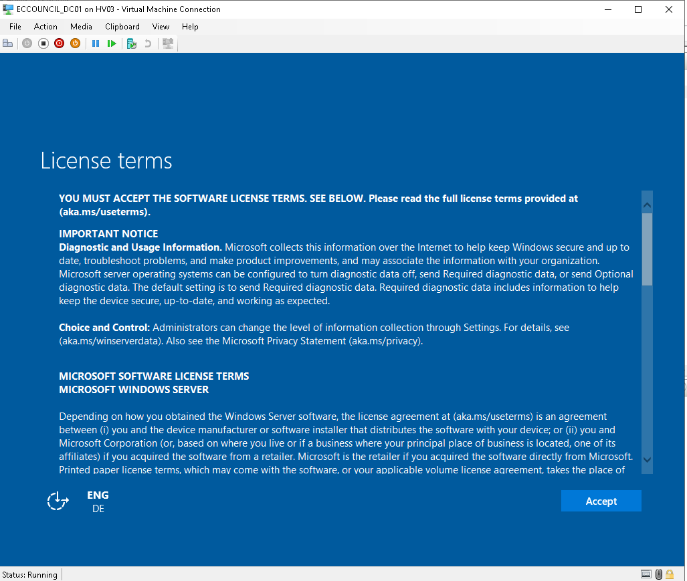
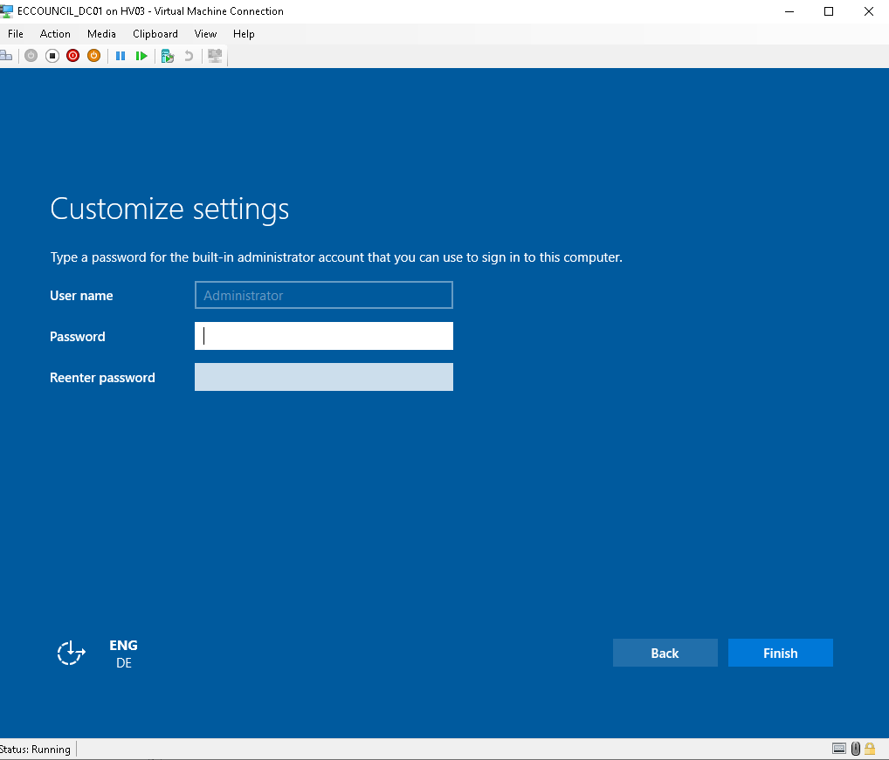

# Lab Environment

This Confluence page describes how to setup the Lab Environment for this course.

- [Lab Environment](#lab-environment)
- [Diagram](#diagram)
- [VM Details](#vm-details)
- [Installation Process](#installation-process)
- [Install Hyper-V](#install-hyper-v)
  - [Variables](#variables)
- [Create VMs](#create-vms)
  - [Declare VMs](#declare-vms)
  - [Variables](#variables-1)
- [Install DC](#install-dc)
  - [Download template VHD file](#download-template-vhd-file)
  - [Setup Variables](#setup-variables)
  - [Start Installation](#start-installation)

# Diagram

This is the diagram that contains details about VMs that will be created.

# VM Details

|  Name | Role  | IP Address
|---|---|---|
| DC01 | Domain Controller  | 10.0.0.10
| HV01 | Hyper-V  | 10.0.0.20
| HV03 | Hyper-V  | 10.0.0.30
| SCVMM01 | System Center Virtual Machine Manager | 10.0.0.40

# Installation Process

In order to create the setup properly, it is necessary to complete the process according:
- [install_hyper-v](1_install_hyper-v.ps1)
- [create_vms](2_create_vms.ps1)
- [install_dcs](3_install_dc.ps1)

# Install Hyper-V

In order to complete the installation of Hyper-V on your machine, you can execute the script [1_install_hyper-v.ps1](1_install_hyper-v.ps1), according: 

- Install Hyper-V role (Reboot is required)
- Execute again the script, in order to complete additional steps
- Create a vSwitch to VMs
- Enable `enhanced_sessions`

## Variables 

The variables were setup according:
- `$VMS_PATH`: The partition to host VMs
- `$VMS_DIR`: Directory to host the VMs
- `VHD_PATH`: Directory to store "Virtual Hard Disks" files
- `VMS_SWITCH`: The name of vSwitch to be created

# Create VMs

After install Hyper-V, it is necessary to create Virtual Machines required to this course, therefore, you should execute the script [2_create_vms.ps1](2_create_vms.ps1), that is expect to complete the steps:
- Install VM on properly path
- Set number of vProcessors
- Set memory, `dynamic` or `static`, according declaration of VM
- Set `Automatic Start Action` and `Automatic Stop Action`
- Set boot order to IDE controller
- Remove DVD drive
- Create VHD directory
- Connect VM to vSwitch
- Set `nested virtualization` on VMs, according declaration

## Declare VMs 

The declaration of VMs is defined in a single line by comma, according:
- Name of vm
- Nested Virtualization
- Memory Type
- Memory Delaration 

## Variables

The variables were setup according:
- `$VMS_PATH`: The path to store VMs (Need to reflect the declaration on [1_install_hyper-v.ps1](1_install_hyper-v.ps1))
- `$VMS_GENERATION`: The Generation of VM, should be `1` to associate default vhd template files
- `$VMS_PROCESSORS`: Number of `vProcessors` associated to each VM
- `$VMS_SWITCH`: Name of `vSwitch` to connect each VM (Need to reflect the declaration on [1_install_hyper-v.ps1](1_install_hyper-v.ps1))

# Install DC

 In order to create a `Domain Controller` for this lab environment, it is necessary to prepare your environment, according:

## Download template VHD file

This step is necessary to download a VHD file of `Windows Server 2022`, that will be required to setup the Operational System according the model provided by Microsoft, according:

- Visit the website [Evaluation Center](https://www.microsoft.com/en-us/evalcenter/evaluate-windows-server-2022), and then select the option `Download the VHD`

- Complete the registration:

**Download the VHD file.**

## Setup Variables

The variable need to be setup, according:
- `$VM_NAME`: Name of VM to install DC, should reflect the value of [2_create_vms.ps1](2_create_vms.ps1)
- `VM_HOSTNAME`: Set the hostname
- `$VM_IP_ADDR`: IP Address to setup on VM
- `$VM_IP_PREFIX`: Subnet to setup on VM
- `$DOMAIN_NAME`: Name of domain to create
- `VMS_PATH`: Directory to install VMs (Shold reflect the value on [1_install_hyper-v.ps1](1_install_hyper-v.ps1))
- `$VHD_TEMPLATE`: Path of the VHD that was downloaded on previous step
- `$VM_USER`: Name of the user to complete the authentication
- `$VM_PASSWORD`: The password to be associated on VM and domain, and then complete the authentication

## Start Installation

Execute the script [3_install_dc.ps1](3_install_dc.ps1), and then complete then wait for the message:

- Script will be on wait state, install next steps are complete
 

- Set the regional settings
  

- Accept the contract
  

- Set password
  

After VM is ready to be remote connected, you need to execute the script again, that is expect to complete the steps:
- Rename VM (Restart is required, therefore start the execution again)
- Set IP Address
- Set DNS address
- Install ADDS Role
- Install Hyper-V Feature (For management proposals only)
- Create the forest