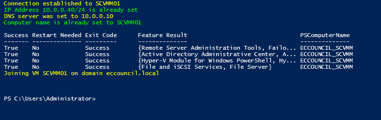

# Setup SCVMM

This section contains details about the setup of SCVMM server.

- [Setup SCVMM](#setup-scvmm)
- [Download VHD template](#download-vhd-template)
- [Script execution](#script-execution)
  - [Variables](#variables)
  - [Extracting VHD](#extracting-vhd)
  - [First Setup](#first-setup)

# Download VHD template

Before you get start, it is necessary to download the [VHD template file of SCVMM2016](https://www.microsoft.com/en-us/download/details.aspx?id=54181), according:


After that, you need to select to download all files, that will represent an amount of more than **16GB**:


You can now complete the steps and then wait until download is completed.

# Script execution

In order to execute the script [setup_VM.ps1](setup_VM.ps1), it is necessary check the value of the variables `$SCVMM_INSTALL_FILE` and `$VMs_PATH`, the rest of variables you can keep the default values:

## Variables

- `SCVMM_INSTALL_FILE`:  It is necessary to match the path that you download the VHD template file, according topic [Download VHD template](#download-vhd-template).

- `VMs_PATH`: It is necessary to match the path that you deployed your VMs, according previous modules, you can use the command `Get-VM -VMName "ECCOUNCIL_SCVMM" | Select-Object -Property Path` to check the path, according example:
```
$ Get-VM -VMName "ECCOUNCIL_SCVMM" | Select-Object -Property Path

Path
----
V:\VMs\ECCOUNCIL_SCVMM
```
## Extracting VHD

After the execution, the script will take some take to extract the VHD file, and then associate to VM properly, it is expect that you wait a few minutes until process is completed.


## First Setup

It is necessary to complete the first setup of VM, therefore, script will ask you to complete the steps, and then click on the confirmation button, only after this procedure is complete:

***Do not click on OK button yet.***

Now you need to logon on SCVMM VM and the complete the steps below:

Set the Regional seetings according yor region:


Define the password

After password has been defined, you can click on the ok button, and then script continue the process, according:

***As you can see a restart was required, therefore, you need to execute the script again***

After you execute the script again, the process is completed, according:


You can now logon on SCVMM server directly on eccouncil domain:
